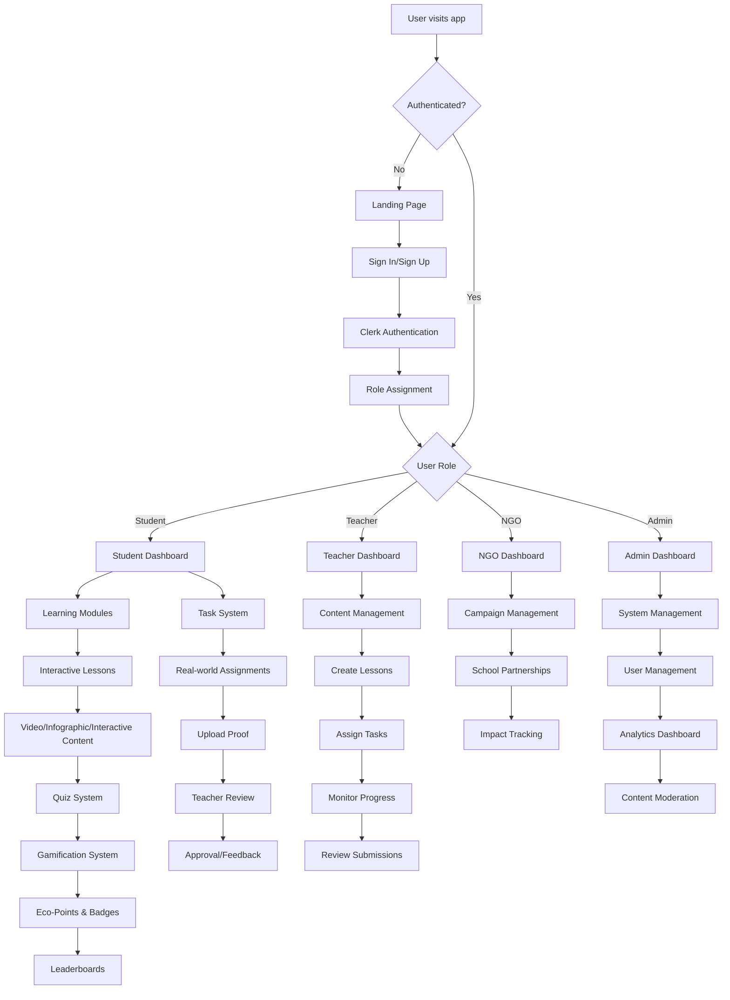
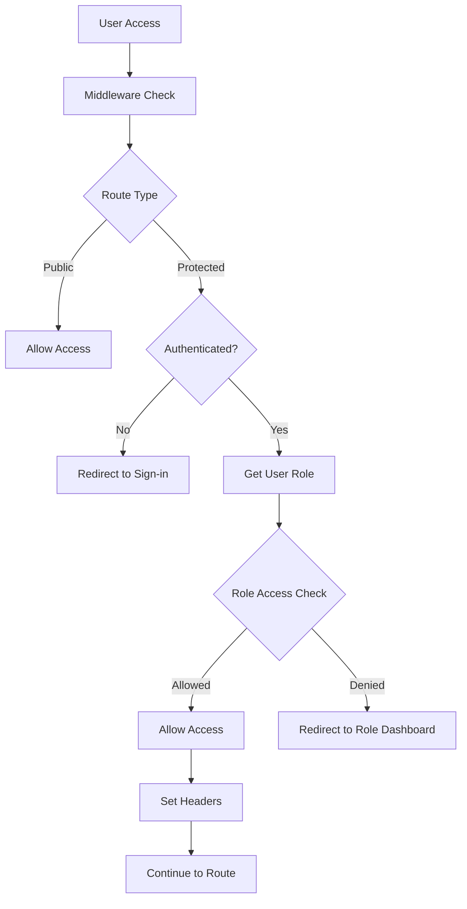
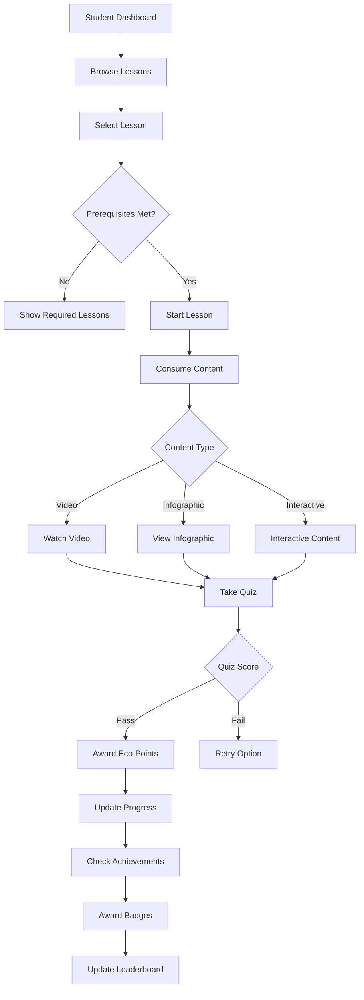
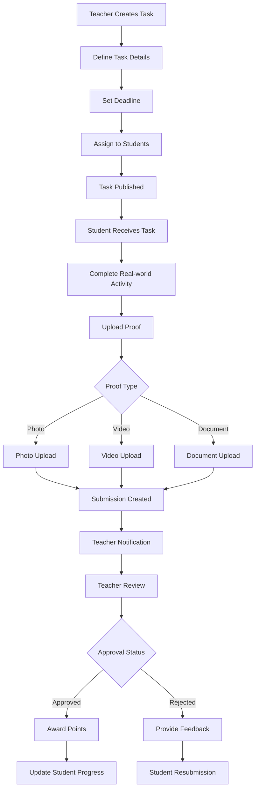
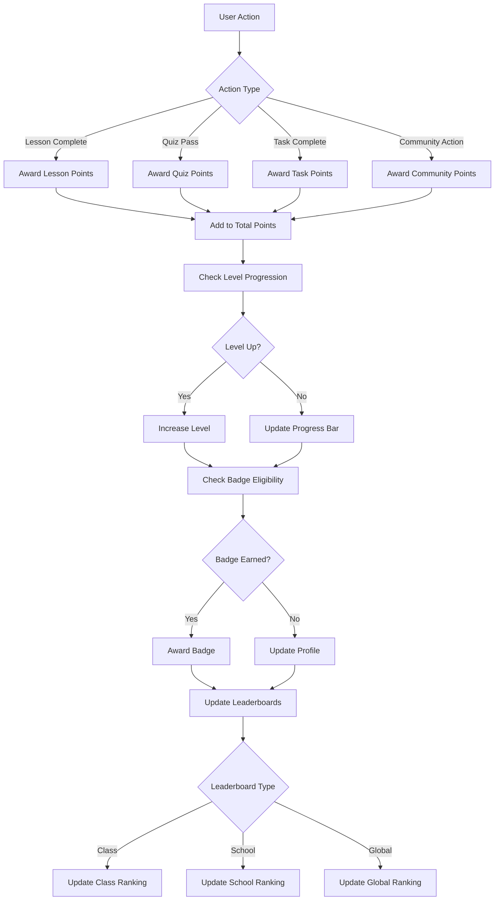
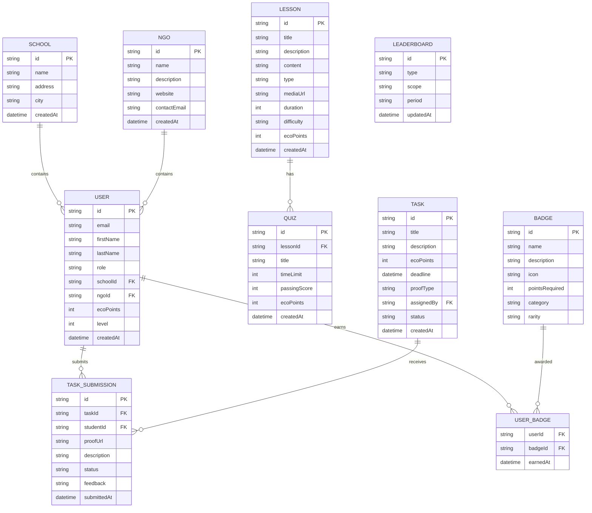
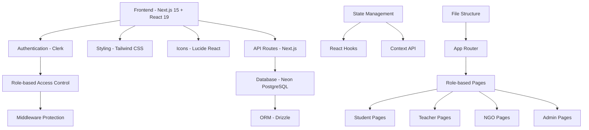
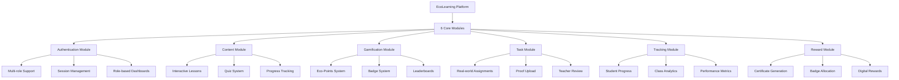
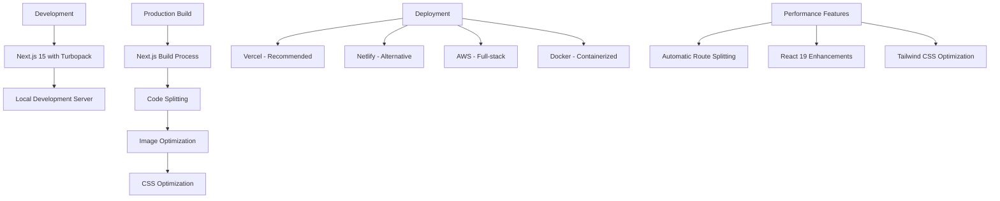

# EcoLearning Platform - Application Flowchart

## Overview
This flowchart illustrates the complete architecture and user flows of the EcoLearning Platform, an environmental sustainability education platform built with Next.js 15, React 19, TypeScript, and Clerk authentication.

## Main Application Flow



## Detailed Module Breakdown

### 1. Authentication & Authorization Flow



### 2. Student Learning Flow



### 3. Task Management Flow



### 4. Gamification System



### 5. Database Schema Relations



## API Endpoints Structure

```mermaid
graph TD
    A[API Routes] --> B[/api/lessons]
    A --> C[/api/quizzes]
    A --> D[/api/tasks]
    A --> E[/api/badges]
    A --> F[/api/leaderboard]
    A --> G[/api/progress]
    
    B --> H[GET - Fetch Lessons]
    B --> I[POST - Create Lesson]
    
    C --> J[GET - Fetch Quizzes]
    C --> K[POST - Submit Quiz]
    
    D --> L[GET - Fetch Tasks]
    D --> M[POST - Create Task]
    D --> N[PUT - Update Submission]
    
    E --> O[GET - User Badges]
    E --> P[POST - Award Badge]
    
    F --> Q[GET - Leaderboard Data]
    
    G --> R[GET - User Progress]
    G --> S[POST - Update Progress]
```

## Technology Stack Integration



## Key Features Integration



## Deployment & Performance



---

## Summary

The EcoLearning Platform is a comprehensive environmental education system that:

1. **Supports Multiple User Roles**: Students, Teachers, NGOs, and Administrators
2. **Provides Interactive Learning**: Through lessons, quizzes, and real-world tasks
3. **Implements Gamification**: With eco-points, badges, and leaderboards
4. **Ensures Security**: Through Clerk authentication and role-based access control
5. **Tracks Progress**: With detailed analytics and monitoring systems
6. **Encourages Real Action**: Through task assignments and proof submissions

The platform uses modern web technologies (Next.js 15, React 19, TypeScript) and integrates with secure authentication (Clerk) and database services (Neon PostgreSQL) to provide a scalable, performant solution for environmental education.
